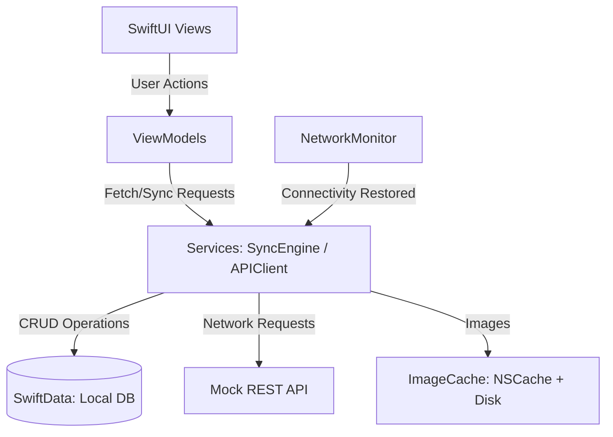
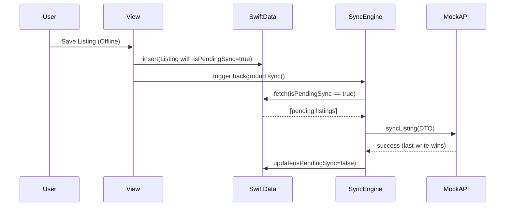

# RogersOfflineMarketPlace.

> A native iOS marketplace app demonstrating offline-first architecture, SwiftData persistence, custom image caching, and background synchronization.

## 📱 Project Overview
RogersOfflineMarketPlace. is a native iOS application built entirely with Swift and SwiftUI. It was architected to demonstrate advanced, production-ready iOS engineering practices. Core capabilities include a robust background synchronization engine with Last-Write-Wins (LWW) conflict resolution, local database persistence via SwiftData, and a highly optimized memory-capped Image Cache.

---

## ✨ Core Features & Requirements Addressed

- **Offline-First & Local DB:** Utilizes **SwiftData** for full local persistence. Users can create or edit listings completely offline.
- **Background Synchronization:** A custom `SyncEngine` (`ModelActor`) detects connectivity via `NWPathMonitor` (in `NetworkMonitor`) and pushes offline queues to the mock REST API automatically.
- **Conflict Resolution:** Implements a Timestamp-based Last-Write-Wins (LWW) strategy during the sync lifecycle.
- **Efficient Image Caching:** `ImageCache` (Services layer) enforces a strict memory limit via `NSCache` + Disk. Images are downsampled via `byPreparingThumbnail` on a detached background thread prior to caching.
- **Native Photo Integration:** Uses `PhotosPicker` (PhotosUI) with `Task.detached` for non-blocking background image decoding. Keeps the main thread and keyboard fully responsive.
- **Security:** `KeychainManager` handles secure token storage via the iOS Security framework.
- **CI/Lint:** GitHub Actions pipeline configured with SwiftLint.

---

## 🗂 Project Structure

```
RogersOfflineMarketPlace./
├── Components/
│   └── CachedAsyncImage        # Async image view with two-tier cache
├── Models/
│   └── Listing                 # SwiftData model
├── Services/
│   ├── APIClient               # Mock REST API + APIClientType protocol
│   ├── ImageCache              # NSCache + Disk cache actor
│   ├── KeychainManager         # Secure token storage
│   ├── NetworkMonitor          # NWPathMonitor for connectivity detection
│   └── SyncEngine              # Offline sync queue with LWW resolution
├── ViewModels/
│   └── ListingListViewModel    # Sync state management
├── Views/
│   ├── EditListingView         # Create / Edit listing form
│   ├── ListingDetailView       # Full listing detail screen
│   └── ListingListView         # Main marketplace feed
└── RogersOfflineMarketPlace.App        # App entry point + ModelContainer setup

RogersOfflineMarketPlace.Tests/
├── EditListingViewTests        # Save logic and input validation tests
├── ListingListViewModelTests   # Sync state machine tests
├── MockAPIClientTests          # LWW conflict resolution tests
└── SyncEngineTests             # Offline queue upload tests
```

---

## 🏗 Architecture

The app follows strict **MVVM (Model-View-ViewModel)** architecture.



### Sync Lifecycle Sequence



---

## 🚀 Performance & Memory Considerations

- **Lazy Loading:** SwiftData's `@Query` lazily loads records as the SwiftUI `List` scrolls — no full table loads into RAM.
- **Thumbnail Downsampling:** `ImageCache` calls `byPreparingThumbnail(ofSize:)` on a `Task.detached` background thread before inserting into `NSCache`, reducing image footprint by up to 90%.
- **NSCache Cap:** Memory cache is capped at 100 images to prevent Jetsam memory pressure kills during heavy scrolling.
- **Actor Isolation:** Both `ImageCache` and `SyncEngine` are Swift `actor`s, keeping all disk I/O and network work off the `@MainActor` thread to guarantee 60fps scrolling.

---

## 🛠 Engineering Standards

- **Concurrency:** Swift Structured Concurrency only — `async/await`, `Task`, `Task.detached`, `Actors`. No GCD or completion handlers.
- **Dependency Injection:** `APIClientType` protocol allows full mock injection for isolated unit testing.
- **Error Handling:** Domain `Error` enums with `do/catch`. All errors logged via `OSLog` (`Logger`), never `print`.
- **Security:** `KeychainManager` stores API tokens using the iOS `Security` framework — never `UserDefaults`.

---

## 💻 Setup Instructions

1. Clone this repository.
2. Open `RogersOfflineMarketPlace.xcodeproj` in **Xcode 15** or later.
3. Select an iOS Simulator running **iOS 17.0+**.
4. Press `Cmd + R` to build and run.
5. Press `Cmd + U` to run the full unit test suite.

### CI (GitHub Actions)
```yaml
xcodebuild test \
  -project RogersOfflineMarketPlace.xcodeproj \
  -scheme RogersOfflineMarketPlace \
  -destination 'platform=iOS Simulator,name=iPhone 15,OS=17.2'
```
